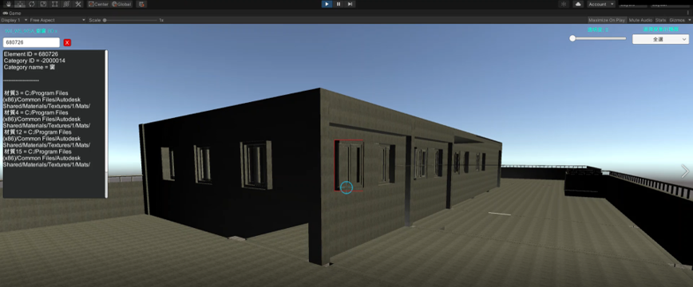
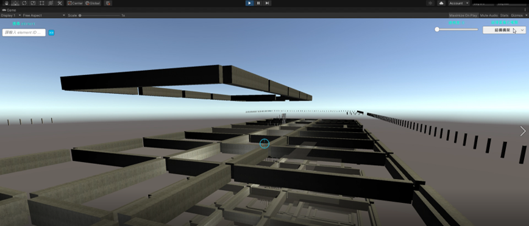

# BIM-Unity

## 主要功能
  
* 點擊模型元件可即時顯示其相關資訊於左上面板中。
* 可於左上面板直接輸入元件ID，系統會顯示其相關資訊並以紅框標示其位置。

* 可透過右上角下拉是選單選擇要看的元件，其餘未被選到的元件將變透明。
* 可透過右上角滾動調調整透明度。

## 介紹影片  
https://drive.google.com/file/d/1fAF4qTlvVKLw4XONXvtqNuVv2YUGXl46/view?usp=sharing  
(前半部由於錄影軟體限制許多視窗無法顯示於影片中，以此為補充資料: https://docs.google.com/document/d/1wNKe3QZgKf3TW_85SLRQ5bDAdCqyRGLi/edit?usp=sharing&ouid=118263627963037388538&rtpof=true&sd=true)

## 書面報告
https://drive.google.com/drive/u/1/folders/18aI6smzihqPdOZ7jfzBFXWlUmltpzJ2R

